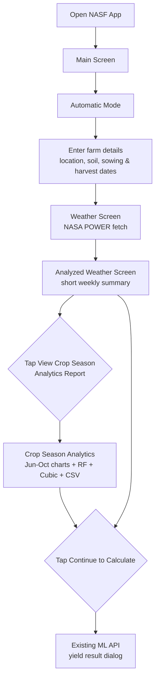
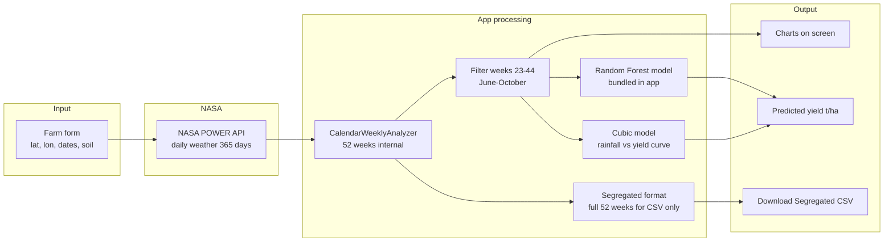
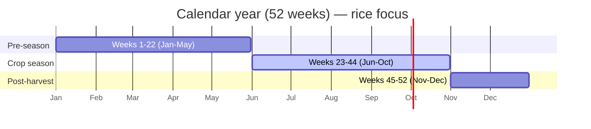
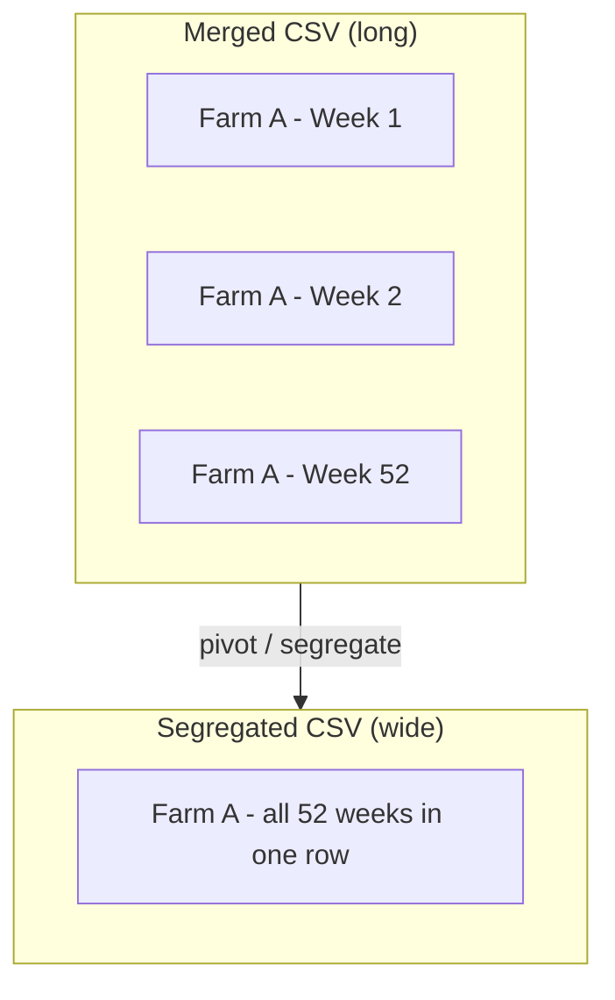
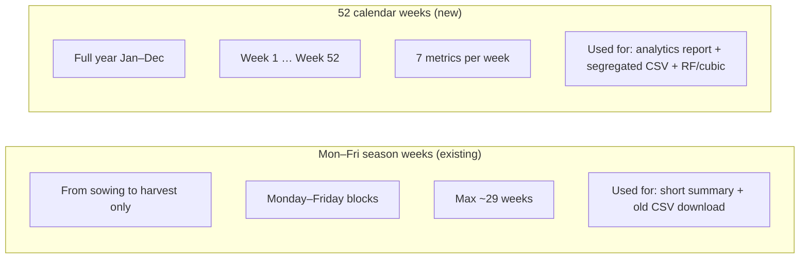
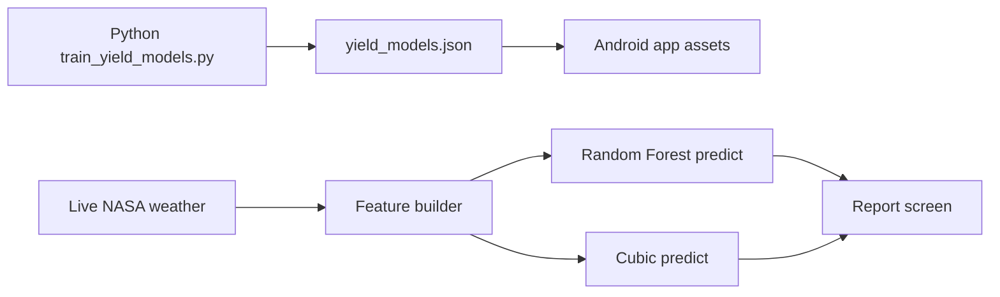
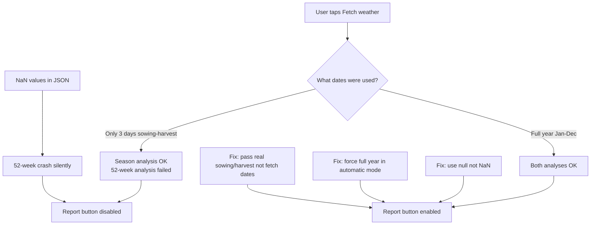

# June–October Crop Season Analytics — Simple Guide

This document explains the **Crop Season Analytics Report** screen in the NASF Android app: **June–October** weather charts, **Random Forest** and **Cubic** yield models (trained on crop-season data), and a **full 52-week segregated CSV** download unchanged from the research format.

---

## 1. What problem does this solve?

Farmers and advisors need more than a single yield number. They need to see:

- How **rain, temperature, humidity, sun, and wind** changed **week by week during June–October** (rice crop season)
- Which weeks matter most for **rice** (sowing in **June**, harvest in **October**)
- A **yield estimate** from machine-learning models trained on real farm data
- A file in the same **segregated CSV format** used for research and training

The new feature adds all of this inside the Android app.

---

## 2. Big picture (in one sentence)

> The app fetches **one full year of NASA weather**, uses **June–October (weeks 23–44)** for charts and ML models, and still exports the **full 52-week segregated CSV** for download.

---

## 3. User journey — step by step



### What you do on each screen

| Step | Screen | What you do |
|------|--------|-------------|
| 1 | **Automatic Mode** | Enter state, crop (rice), latitude, longitude, sowing date (~June), harvest date (~October), and other farm inputs |
| 2 | **Weather (NASA POWER)** | Tap **Fetch**. The app automatically requests **1 Jan – 31 Dec** of the sowing year (not just 3 days) |
| 3 | **Analyzed Weather** | Read the short summary. Tap **View Crop Season Analytics Report** |
| 4 | **Crop Season Report** | Scroll Jun–Oct charts, see Random Forest & Cubic algorithms, preview/download segregated CSV (52-week file) |
| 5 | **Continue to Calculate** | Same as before — calls the existing server for final yield advice |

---

## 4. Data flow — from NASA to your phone



### Simple explanation of each box

| Box | Plain English |
|-----|----------------|
| **Farm form** | Information you type: where the field is, when you sow and harvest |
| **NASA POWER** | Free global weather database — daily rain, temperature, etc. |
| **Weather charts** | **June–October only** (weeks 23–44) |
| **Random Forest / Cubic** | **June–October season aggregates** only |
| **Segregated CSV download** | **Full 52 weeks** (unchanged research format) |

---

## 5. Rice season on the 52-week calendar

Rice in this project: **sow in June**, **harvest in October**.

On the charts, **only weeks 23–44** (June–October) are displayed for weather and ML models.



| Calendar part | Approx. weeks | Meaning for rice |
|---------------|---------------|------------------|
| January – May | 1 – 22 | Before sowing |
| **June** | **~23 – 27** | **Sowing period** |
| July – September | 28 – 39 | Growing |
| **October** | **~40 – 44** | **Harvest period** |
| November – December | 45 – 52 | After harvest |

---

## 6. What is “segregated CSV”?

Think of it as a **spreadsheet layout** designed for machine learning.

### Long format (merged CSV) — many rows per farm

One farm → **52 rows** (one row per week).

### Segregated format — one row per farm

One farm → **one row**, with **hundreds of columns**:

```
week01_rainfall_total, week02_rainfall_total, … week52_rainfall_total,
week01_rainfall_mean,  week02_rainfall_mean,  … week52_rainfall_mean,
week01_relative_humidity, …,
week01_solar_radiation, …,
week01_t_min, …,
week01_t_max, …,
week01_wind_speed, …
```

**7 metrics × 52 weeks = 364 weather columns**, plus farm fields (location, yield, soil, etc.).



The app **builds the same column names** from live NASA data and lets you **download** a segregated-style CSV for your farm.

---

## 7. What you see on the Crop Season Analytics screen

```mermaid
flowchart TB
    subgraph Report["WeeklyAnalyticsReportActivity"]
        direction TB
        S[Farm summary card<br/>location, year, season rainfall]
        RF[Random Forest card<br/>predicted yield + top drivers chart]
        CU[Cubic model card<br/>rainfall vs yield curve]
        SEG[Segregated CSV preview<br/>first 8 weeks sample text]
        DL[Download Segregated CSV button]
        W1[Rainfall bar chart - Jun-Oct weeks]
        W2[Temperature min/max lines]
        W3[Humidity line chart]
        W4[Solar radiation line chart]
        W5[Wind speed line chart]
        BTN[Continue to Calculate]
    end
```



| Section | What it shows |
|---------|----------------|
| **Farm summary** | Your coordinates, calendar year, total rain during Jun–Oct |
| **Random Forest** | Predicted yield (t/ha) with algorithm title on chart; uses Jun–Oct season data |
| **Cubic model** | Smooth curve with algorithm title; seasonal rainfall (Jun–Oct) vs yield |
| **Segregated preview** | Text sample of full 52-week column names (export unchanged) |
| **Download** | Full 52-week segregated CSV file saved to device |
| **Weather charts** | June–October only (weeks 23–44) |

---

## 8. Two types of “weekly” analysis (important)

The app now uses **two** weekly methods. They serve different purposes.



| Feature | Mon–Fri (old) | 52 calendar weeks (new) |
|---------|---------------|------------------------|
| Date range | Sowing → harvest | Full calendar year |
| Week count | Up to 29 | 52 |
| Matches segregated CSV | Partially | Yes |
| Powers analytics report | No | Yes |

---

## 9. Machine learning — explained simply

### Random Forest (RF)

- **Trained on:** `exports/rice_nasapower_weekly_segregated.csv` (1,056 farms)
- **Script:** `train_yield_models.py`
- **Stored in app as:** `app/src/main/assets/ml/yield_models.json`
- **How it works (simple):** Many small “decision trees” vote on yield. Each tree asks questions like “Was season rainfall above 800 mm?” and “Was average max temperature high?”
- **On phone:** The app runs a lightweight version of those trees — no internet needed for RF/cubic prediction

### Cubic model

- **Uses mainly:** Total rainfall during crop season (June–October)
- **Shape:** A smooth **cubic curve** (not a straight line)
- **Purpose:** Easy visual story — “more rain helps up to a point”
- **Shown as:** Curve chart with your farm as an orange dot



### Retrain after new farm data

```bash
cd NASA_Project
.venv/bin/python train_yield_models.py --input exports/rice_nasapower_weekly_segregated.csv
```

Then rebuild the Android app so the new `yield_models.json` is included.

---

## 10. Recent code changes — file map

### New Android screens & navigation

| File | Role |
|------|------|
| `WeeklyAnalyticsReportActivity.kt` | Main 52-week report UI |
| `activity_weekly_analytics_report.xml` | Layout with charts and segregated section |
| `WeeklyAnalyticsNavigation.kt` | Opens report from analyzed screen |
| `NasaPowerAnalyzedActivity.kt` | **View Crop Season Analytics Report** button |

### Weather & 52-week logic

| File | Role |
|------|------|
| `CalendarWeeklyAnalyzer.kt` | Builds 52 weeks × 7 metrics from NASA JSON |
| `CalendarWeekGenerator.kt` | Defines week 1–52 date ranges for a year |
| `SeasonWeekMapper.kt` | June–October = weeks 23–44 |
| `FeatureVectorBuilder.kt` | Prepares inputs for ML models |
| `SegregatedCsvExporter.kt` | Creates & previews segregated CSV |
| `WeeklyChartHelper.kt` | Draws MPAndroidChart graphs |
| `YieldModelPredictor.kt` | Runs RF + cubic on device |
| `MlSubmitHelper.kt` | Shared “Continue to Calculate” logic |
| `WeatherActivity.kt` | Forces **full-year** NASA fetch in automatic flow |

### Python & assets

| File | Role |
|------|------|
| `train_yield_models.py` | Trains RF + cubic, exports JSON |
| `app/src/main/assets/ml/yield_models.json` | Bundled models for offline prediction |

### Config

| Change | Why |
|--------|-----|
| `WeatherConfig.FULL_YEAR_ANALYZED_PARAMETERS` | Adds temperature + wind to NASA request |
| `MPAndroidChart` in `app/build.gradle` | Chart library |
| `WeeklyAnalyticsReportActivity` in `AndroidManifest.xml` | Registers new screen |

---

## 11. Bugs we fixed (so buttons work)



| Problem | Symptom | Fix |
|---------|---------|-----|
| Full-year fetch dates sent as “sowing/harvest” | “Season exceeds 200 days” | Pass **real crop dates** separately from NASA fetch range |
| Only 3 days of weather fetched | Empty charts, weak predictions | **Automatic mode** always fetches Jan 1 – Dec 31 |
| `NaN` in JSON for empty weeks | Report button stayed grey | Store **null** instead of `NaN` in weekly JSON |
| Report tied only to calendar pre-check | Button disabled even when fixable | Enable report when **weather + sowing date** exist; report screen rebuilds analysis |

---

## 12. Tips for testing

1. Use **Automatic Mode** (not manual weather-only entry).
2. Pick **real latitude/longitude** (India: roughly 8°–35° N, 68°–97° E).
3. Set **sowing in June** and **harvest in October** via the date picker.
4. On the weather screen, confirm fetch runs for the **whole year** (you should see a long CSV download message).
5. On the analyzed screen, **View Crop Season Analytics Report** should be **purple/active**.
6. On the report screen, use **Download Segregated CSV** and open the file in Excel.

---

## 13. Glossary

| Term | Simple meaning |
|------|----------------|
| **NASA POWER** | Free weather data service used by the app |
| **Segregated CSV** | One row per farm; weekly weather split into many columns by metric type |
| **52-week calendar** | India-style year split into 52 indexed weeks (from `nasapower 30 yrs.xlsx` template) |
| **t/ha** | Tonnes per hectare — yield unit |
| **Random Forest** | ML model using many decision trees |
| **Cubic model** | Polynomial curve (degree 3) relating rainfall to yield |
| **Crop season weeks** | Weeks 23–44 (June–October band for rice) |

---

## 14. Related documentation

- [Segregated dataset README](segregated_dataset/README.md) — column definitions and Python scripts
- [Merged dataset README](merged_dataset/README.md) — long-format 52-week CSV
- [NASA POWER integration](NASA_POWER_INTEGRATION.md) — API details
- [Weather wiring guide](WEATHER_WIRING_GUIDE.md) — how screens connect

---

## 15. 30-Year June–October Climate Screen

A separate report shows **~30 years** of NASA POWER **monthly** data for the **June–October** crop season.

| Screen | Time span | Granularity | CSV export | ML |
|--------|-----------|-------------|------------|-----|
| **Crop Season Analytics** (existing) | 1 calendar year | Weekly (weeks 23–44) | Full 52-week segregated file | RF + Cubic for current season |
| **30-Year Jun–Oct** (new) | ~1996–2025 | Monthly Jun–Oct per year | `climate_30yr_jun_oct_*.csv` | RF + Cubic **per selected year** + 30-year RF trend |

### How to open

1. **Weather screen** — tap **View 30-Year June–October Report** (fetches monthly NASA data, then opens the screen).
2. **Analyzed screen** — tap **View 30-Year Climate Report** (same fetch; also passes daily weather for **Continue to Calculate** in automatic flow).

### What you see

- Historical bar/line charts with **year** on the x-axis (rainfall, temperature).
- **Year spinner** — pick a year for monthly Jun–Oct detail and per-year RF/Cubic cards.
- **30-year yield trend** — Random Forest prediction line across all years.
- **Download 30-Year Jun–Oct CSV** — monthly rows × years (not the 52-week segregated wide file).

### Key files

| File | Role |
|------|------|
| `ThirtyYearCropSeasonActivity.kt` | 30-year report UI |
| `MonthlyCropSeasonAnalyzer.kt` | Parses monthly JSON → Jun–Oct per year |
| `MonthlyCropSeasonCsvExporter.kt` | 30-year summary CSV |
| `ThirtyYearNavigation.kt` | Intent launcher |
| `WeatherConfig.FULL_YEAR_MONTHLY_PARAMETERS` | Monthly params for ML-aligned metrics |

---

## 16. 2026 Wind & Power Model Comparison Screen

A third analytics report compares **five yield models** on **weeks 23–43** using live NASA POWER weather aligned with the segregated CSV (wind speed + solar radiation columns).

| Item | Detail |
|------|--------|
| **Entry** | NASA Analyzed screen → **View 2026 Wind & Power Model Report** |
| **Weeks** | 23–43 (21 weeks) |
| **Charts** | Tmin/Tmax, wind, solar, rainfall |
| **Models** | Random Forest, Cubic, XGBoost, ANN, SVM |
| **Metrics shown** | Predicted yield (t/ha) + training RMSE, STDV, R² per model |
| **Training data** | `exports/rice_nasapower_weekly_segregated.csv` |
| **Retrain script** | `train_yield_models_extended.py` → `yield_models_extended.json` |

Button enabled when sowing year is **2026+** and full-year weather is loaded.

---

## 17. Climate ANN Yield Screen (Rain / Tmin / Tmax)

A dedicated report predicts yield using a **3-input ANN** aligned with the research paper (Rain, Tmin, Tmax → Yield). This replaces the misleading rainfall-only Cubic yield for users who need temperature-aware prediction.

| Item | Detail |
|------|--------|
| **Entry** | NASA Analyzed screen → **View Climate ANN Yield (Rain/Tmin/Tmax)** |
| **Predictors** | Season rainfall (mm), mean Tmin (°C), mean Tmax (°C) |
| **Model** | ANN (3 → 5 → 5 → 1), trained on segregated CSV |
| **Week modes** | Crop 23–44 (default), Wind 23–42, Sowing→harvest |
| **Metrics shown** | Predicted yield + training RMSE, STDV, R², MAE |
| **Training data** | `exports/rice_nasapower_weekly_wind_power_segregated123.csv` |
| **Retrain script** | `train_yield_climate3_ann.py` → `yield_models_climate3_ann.json` |

**Note:** The Crop Season Report still shows RF + **rainfall-only Cubic** yield. Use this screen for paper-aligned Rain/Tmin/Tmax ANN yield.

Button enabled when weather is loaded and sowing date is set (same as Crop Season Report).

---

## 18. Climate Yield Form

A form lets users **type season climate values** and calculate yield with a 6-input ANN. No NASA weather fetch is required.

| Item | Detail |
|------|--------|
| **Entry** | Manual / Automatic / Management System → **Climate Yield** |
| **Inputs** | Rain (mm), Tmin mean, Tmax mean, Wind mean, Solar mean, Humidity mean |
| **Model** | ANN (6 → 8 → 5 → 1), trained on segregated123 weeks 23–44 |
| **Training data** | `exports/rice_nasapower_weekly_wind_power_segregated123.csv` |
| **Retrain script** | `train_yield_manual_climate_ann.py` → `yield_models_manual_climate_ann.json` |

**Vs Climate ANN screen:** that report uses live NASA weather (Rain/Tmin/Tmax only). This form is typed entry with six climate fields. Yield is **Excel/CSV-trained on-device** (no API). After each Calculate, the form shows the inputs used and previous → new yield so different entries clearly change the result.

---

*Last updated: July 2026 — Climate Yield form (Excel-only, no API), Climate ANN yield screen (Rain/Tmin/Tmax), June–October crop season analytics, 30-year monthly climate, 2026 wind & power model comparison, segregated CSV export, RF/cubic models, and automatic full-year weather fetch.*
