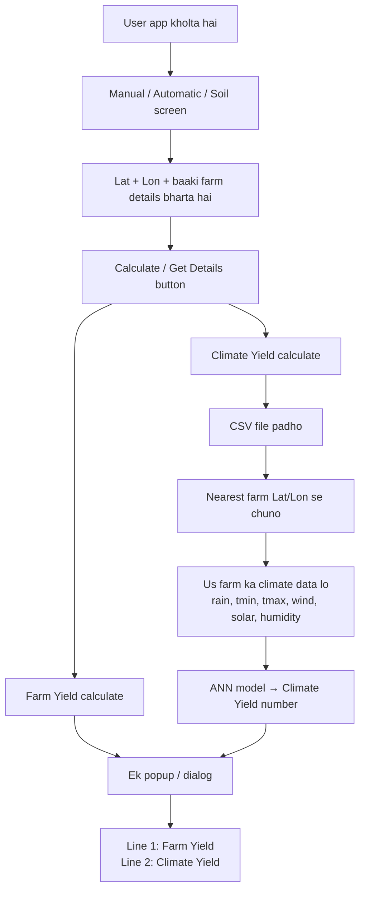
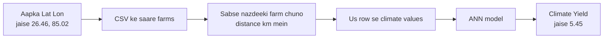
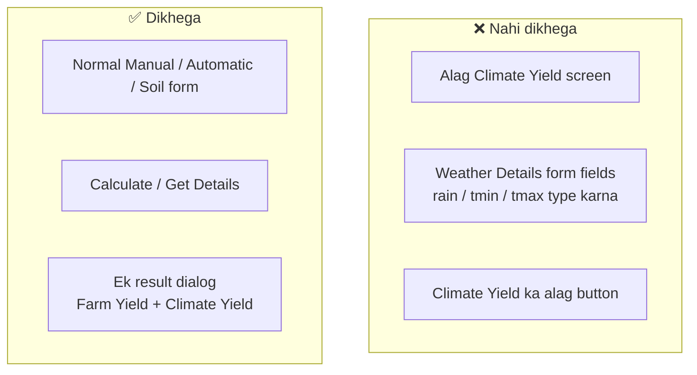

# Climate Yield — Simple Guide (CSV se kaise aata hai)

Yeh document **simple language** mein batata hai ki app mein **Climate Yield** ka number kahan se aata hai, aur aap kaise confirm kar sakte ho ki woh **CSV file** se aa raha hai — alag climate screen / form fields se nahi.

---

## 1. Ek line mein samajho

> Farmer sirf **Latitude + Longitude** daalta hai.  
> App CSV mein **sabse nazdeeki farm** dhoondhti hai.  
> Us farm ka **mausam (climate) data** CSV se uthati hai.  
> Us data se model **Climate Yield** nikaalta hai.  
> Farm Yield + Climate Yield **ek hi popup** mein dikhte hain.

**Climate Yield ke liye koi alag screen / Weather Details form nahi hai.**

---

## 2. Do types ke yield (simple)

| Naam | Simple matlab | Data kahan se |
|------|---------------|---------------|
| **Farm Yield** | Aapke field ke soil / fertilizer / crop inputs se yield | Manual / Automatic / Soil flow (pehle jaisa) |
| **Climate Yield** | Us area ke season mausam se yield | Bundled CSV → nearest farm → ANN model |

Dono **saath** calculate hote hain jab aap **Calculate** / **Get Details** dabate ho.

---

## 3. Big picture diagram



---

## 4. Climate Yield ka andar ka flow (CSV path)

Socho CSV ek **bada phonebook** hai — har row ek farm:

- Farm ka **Latitude / Longitude**
- Season ke weeks (23–44) ka **mausam data**
- (Kabhi) pehle se known yield

App yeh karti hai:



### Climate values CSV se kya uthte hain?

Season weeks **23 se 44** tak:

| Field (simple) | CSV se roughly |
|----------------|----------------|
| Total rainfall | har week ka rainfall jod ke |
| Average T min | weeks ka mean |
| Average T max | weeks ka mean |
| Average wind | weeks ka mean |
| Average solar | weeks ka mean |
| Average humidity | weeks ka mean |

Ye values **form mein type nahi karni** — CSV se automatic aati hain.

---

## 5. File kahan hai?

App ke andar (assets):

```text
app/src/main/assets/data/rice_nasapower_weekly_segregated.csv
```

Code jo yeh kaam karta hai:

```text
CsvClimateYieldBackend  →  CSV padhta hai
ManualClimateAnnPredictor  →  climate se yield predict karta hai
```

Screens jo isko call karti hain:

- **Manual Details** → Calculate
- **Automatic Details** → Calculate
- **Soil / Management** → Get Details

---

## 6. Screen pe kya dikhega / kya nahi



---

## 7. Kaise pata chalega ki data CSV se aa raha hai?

### A) Common sense check
- Form mein climate fields **nahi** hain → user type nahi kar sakta  
- Phir bhi Climate Yield number aata hai → **CSV / backend path** se hi aa sakta hai

### B) Logcat se proof (developer / tester)

Android Studio → **Logcat** → filter:

```text
ClimateCSV
```

Calculate dabane ke baad aisi line dikhegi:

```text
source=data/rice_nasapower_weekly_segregated.csv
input=(26.46, 85.02)
csvNearest=(26.46008, 85.01967) distKm=0.01
rain=... tmin=... tmax=... wind=... solar=... rh=...
climateYield=5.45
```

**Iska matlab (layman):**
- `source` = kaunsi CSV file
- `input` = aapne jo Lat/Lon daala
- `csvNearest` = CSV mein sabse nazdeeki farm
- `rain / tmin / ...` = us farm ke climate numbers (CSV se)
- `climateYield` = un numbers se nikla yield

### C) Quick test
1. Ek Lat/Lon daalo → Climate Yield note karo  
2. Same Lat/Lon dubara → **same** Climate Yield aana chahiye  
3. Bahut door ka Lat/Lon daalo → **alag** nearest farm / alag Climate Yield

---

## 8. Real-life analogy

```text
  Aap (farmer)
      |
      |  "Mera khet yahan hai" (Lat / Lon)
      v
  Phonebook (CSV)  ----->  Nazdeeki gaon / farm dhoondo
      |
      |  Us gaon ka mausam record uthalo
      v
  Calculator (ANN model)  ----->  "Is mausam pe yield ~ 5.45"
      |
      v
  Screen pe dono answers saath:
      Farm Yield (aapka khet)
      Climate Yield (mausam / CSV)
```

Jaise Google Maps aapke location ke nearest petrol pump dikhata hai —  
waise hi app aapke Lat/Lon ke **nearest CSV farm** ka climate use karti hai.

---

## 9. Short FAQ

**Q: Mujhe climate values khud daalni padengi?**  
A: Nahi. CSV se automatic.

**Q: Climate Yield alag page pe dikhega?**  
A: Nahi. Farm Yield ke saath ek hi result mein.

**Q: CSV update karun to kya hoga?**  
A: Nayi CSV assets mein rakho + app rebuild — naye climate numbers / nearest farms use honge.

**Q: Farm Yield bhi CSV se aata hai?**  
A: Nahi. Farm Yield alag path se (API / on-device farm model). Climate Yield alag CSV + climate ANN se.

---

## 10. Summary (yaad rakhne layak)

1. User sirf location (+ farm form) bharta hai  
2. Climate data **CSV** se aata hai (nearest farm)  
3. Model se **Climate Yield** nikalta hai  
4. **Farm + Climate** ek saath result mein  
5. Proof = Logcat tag **`ClimateCSV`**

---

*Document for NASF Android app — Climate Yield CSV backend (on-device).*
