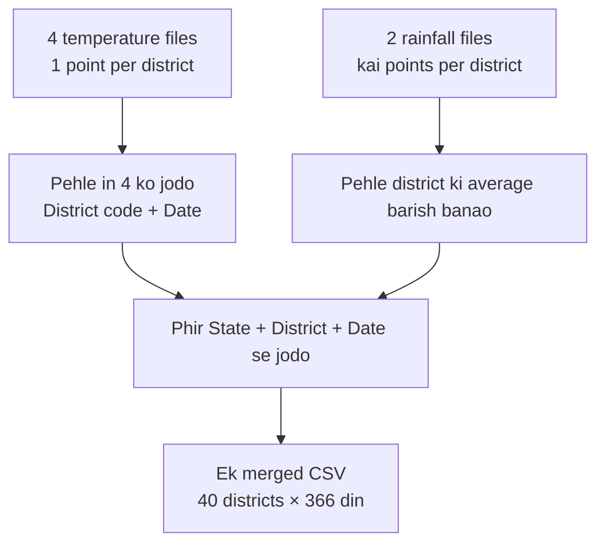

# Chaar States Climatology CSV — Merge kis basis par hua

Yeh document **simple language** mein batata hai ki 6 alag CSV files ko **ek file** mein kaise joda gaya, aur **kis cheez ko milaan** karke rows match kiye gaye.

**Output file:** `exports/Extract_Four_States_Tmax_Tmin_pr_1995-2025_merged.csv`

---

## 1. Ek line mein samajho

> Same **district** + same **calendar day** (jaise 1 January, 15 August) ki saari climate values ek row mein aa gayi.  
> Temperature files ko **district code + date** se joda.  
> Rainfall pehle district ki average banayi, phir **state + district + date** se temperature ke saath jodi.  
> Latitude / longitude se temperature aur rainfall **nahi** jode — unke maps alag hain.

---

## 2. Pehle 6 files kya thin?

Socho har file ek **register** hai. Sab 1995–2025 ke 30 saal ka **normal mausam** (climatology) dikhati hain — har calendar day ke liye average aur variation.

| File (short) | Andar kya tha | Simple matlab |
|--------------|---------------|---------------|
| Tmax mean | din ka maximum temperature, 30-saal average | “Is din normally kitni garmi padti hai” |
| Tmax std | usi Tmax ki variation | “Saal-dar-saal kitna up-down hota hai” |
| Tmin mean | din ka minimum temperature, 30-saal average | “Is din normally kitni thand padti hai” |
| Tmin std | usi Tmin ki variation | “Raat/subah ki thand kitni unstable hai” |
| Rain mean | IMD rainfall, 30-saal average | “Is din normally kitni barish hoti hai” |
| Rain std | usi barish ki variation | “Barish kitni unpredictable hai” |

Pehle yeh 6 baatein **6 alag Excel/CSV** mein thin. Merge ka matlab: **ek hi jagah, ek hi din, saari 6 values ek line mein**.

---

## 3. Do tarah ki files thin — isliye seedha nahi jod sakte the

### Temperature (4 files)

- **40 districts** (Bihar, Haryana, Punjab, Uttar Pradesh ke study districts)
- Har district ka **ek point** (ek tehsil / ek lat-lon)
- Har din ki **ek hi row**
- Example: Amethi, 1 January → sirf 1 line

### Rainfall (2 files)

- **Kai points per district** (IMD grid — ek district ke andar 1 se 11 tak cells)
- Example: Amethi, 1 January → **4 lines** (4 alag lat-lon)

Isliye rainfall ko temperature ke saath **seedha copy-paste** nahi kiya. Pehle district ki **average barish** nikali, phir joda.



---

## 4. Merge kis cheez ko milaan karke hua? (yeh sabse important)

Do rows tab **ek samajhi gayi** jab yeh match hua:

| Kaunsi files | Kya milaya (join key) | Layman matlab |
|--------------|------------------------|---------------|
| 4 temperature files aapas mein | **Dist_Code + date** | Wahi district code, wahi calendar din |
| 2 rainfall files aapas mein | **Lat + Lon + date** | Wahi grid point, wahi calendar din |
| Temperature + rainfall | **STATE + District + date** | Wahi state, wahi district naam, wahi calendar din |

**Date ka matlab yahan saal nahi hai.** Files mein date `01-01-2025` jaisi dikhti thi, lekin 2025 sirf dummy year hai. Asal mein yeh **1 January ka 30-saal normal** hai. Merged file mein isliye date **`MM-DD`** rakhi gayi (`01-01`, `08-15`, `02-29`).

---

## 5. Teen steps, simple example se

### Step 1 — Temperature ki 4 files jodi

Amethi (`Dist_Code` = D680), din = 1 January:

| Source | Value |
|--------|-------|
| Tmax mean file | 19.8 |
| Tmax std file | 3.05 |
| Tmin mean file | 8.87 |
| Tmin std file | 2.43 |

Yeh charon **same district code + same din** par mili, isliye ek row ban gayi.

**District code isliye use hua** kyunki naam confuse kar sakte hain. Kai jagah `TEHSIL` district se alag hai (jaise Gaya district ka point Dumaria tehsil par hai). Code (`D680`, `D97`, …) unique hai.

### Step 2 — Rainfall ki 2 files, phir district average

Amethi 1 January par rainfall ke **4 grid cells** the. Unka average liya:

- Rain mean cells: 0.13, 0.27, 0.18, 0.50 → **average 0.27**
- Rain std cells: 0.40, 0.99, 0.47, 1.72 → **average 0.895**

Yahi numbers merged file mein `IMD_pr_Mean` aur `IMD_pr_std` hain.

### Step 3 — Barish ko temperature wali row se joda

Ab match yeh tha: **UTTAR PRADESH + AMETHI + 01-01**

Isse merged row bani:

```
STATE, District, Dist_Code, TEHSIL, lat, lon, date,
Tmax_mean, Tmax_Std, Tmin_Mean, Tmin_Std, IMD_pr_Mean, IMD_pr_std

UTTAR PRADESH, AMETHI, D680, AMETHI, 26.5, 81.5, 01-01,
19.8, 3.05, 8.87, 2.43, 0.27, 0.895
```

---

## 6. Latitude / longitude se kyun nahi joda?

Temperature ka point **1 degree grid** par hai (jaise Amethi `26.5, 81.5`).  
Rainfall IMD ka **chhota grid** hai (jaise `26.35, 81.45`).

**Ek bhi lat-lon exactly match nahi hota.** Agar lat-lon se join karte, to temperature aur barish kabhi ek row mein nahi aate.

Isliye common zameen yeh li:

> **Kaunsa district + kaunsa calendar din**

Woh dono files mein same naam se maujood hai.

---

## 7. Merged file mein kya-kya column hai

| Column | Simple matlab |
|--------|----------------|
| `STATE` | Rajya |
| `District` | Zila |
| `Dist_Code` | District ka unique code (jaise D680) |
| `TEHSIL` | Jahan se temperature point nikala gaya |
| `lat`, `lon` | Temperature wala study point (rainfall wala grid nahi) |
| `date` | Calendar din `MM-DD` (1 Jan = `01-01`) |
| `Tmax_mean` | 30-saal average maximum temperature |
| `Tmax_Std` | Tmax kitna vary karta hai |
| `Tmin_Mean` | 30-saal average minimum temperature |
| `Tmin_Std` | Tmin kitna vary karta hai |
| `IMD_pr_Mean` | Us district ke IMD cells ki average barish |
| `IMD_pr_std` | Us district ke IMD cells ki average rainfall variation |

---

## 8. File kitni badi hai, kya cover hai

| Cheez | Number |
|-------|--------|
| Rows | 14,640 |
| Districts | 40 |
| Din per district | 366 (leap day `02-29` shamil) |
| States | Bihar, Haryana, Punjab, Uttar Pradesh |
| Empty cells | 0 — har temperature district ke liye rainfall bhi mil gayi |

Temperature ke **saare 40 districts** rainfall file mein the, isliye left join par koi district khali nahi chhoota.

Rainfall file mein **118 extra districts** bhi the (jinhe temperature extract mein nahi liya gaya). Woh merged file mein **nahi** hain. Yeh file sirf un 40 study districts ki hai jahan Tmax/Tmin points the.

---

## 9. Merge se pehle jo chhoti safai hui

- Tmin std file ke date column naam ke aage extra space tha — hata diya.
- Kabhi `STATE` likha tha, kabhi `State`; kabhi `date`, kabhi `Date` — naam ek jaise kiye.
- Rainfall std file mein kuch leap-day rows `29-02-2024` thin, mean file mein `29-02-2025`. Dono ko **2 February 29** (`02-29`) maan kar joda. Saal ignore kiya.

---

## 10. Short checklist — merge sahi hai ya nahi

Agar koi poochhe “kis basis par merge hua?”, jawab yeh hai:

1. **Temperature:** same `Dist_Code`, same calendar day.
2. **Rainfall cells:** same lat-lon, same calendar day; phir district ki **average**.
3. **Dono families:** same **State + District naam + calendar day**.
4. **Lat-lon se nahi,** kyunki temperature aur IMD grid alag hain.
5. **TEHSIL naam se nahi,** kyunki kai jagah tehsil ≠ district.

Yahi basis par `Extract_Four_States_Tmax_Tmin_pr_1995-2025_merged.csv` bani hai.
