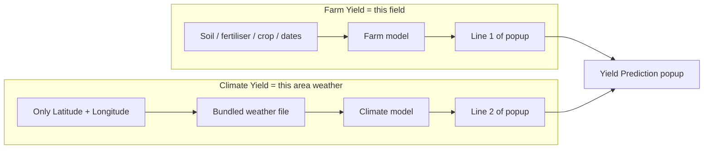
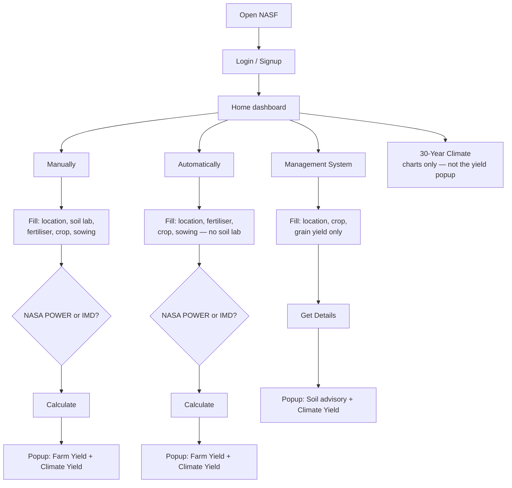
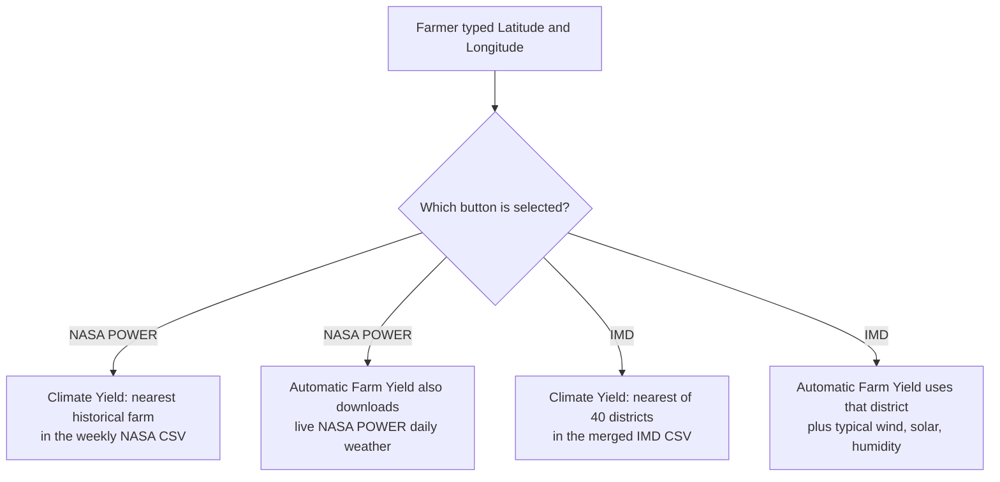
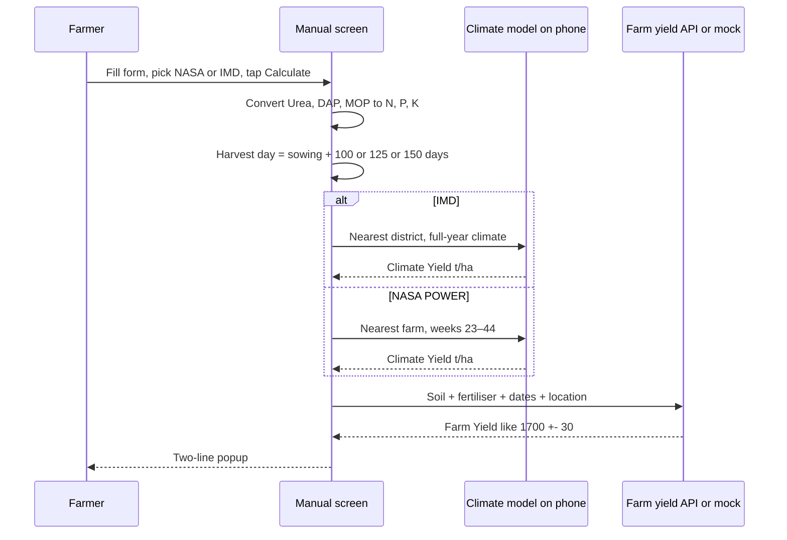
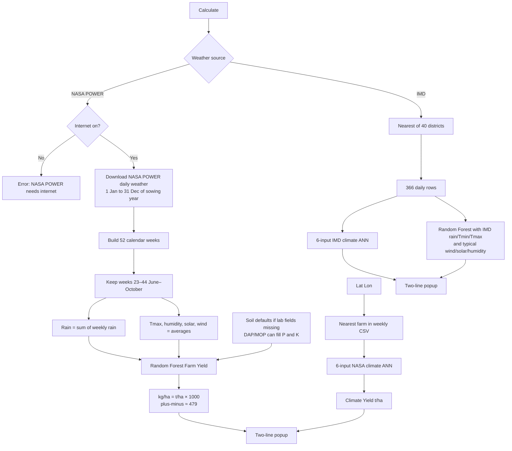
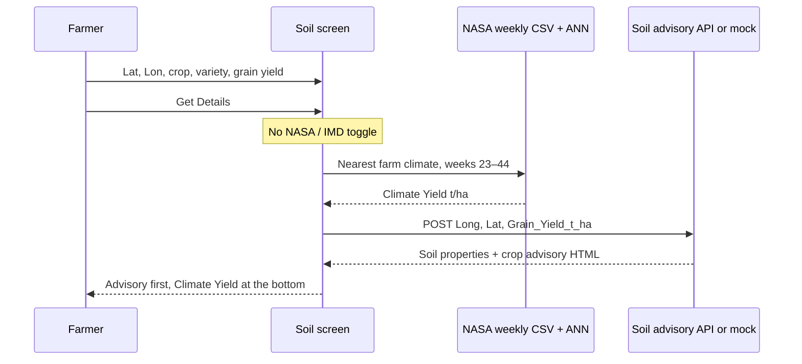
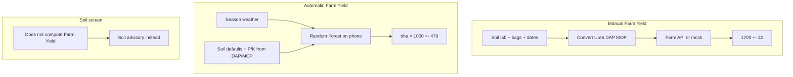
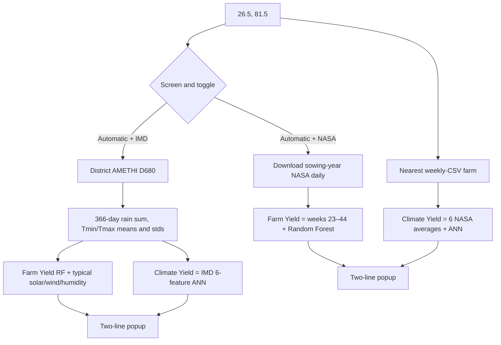
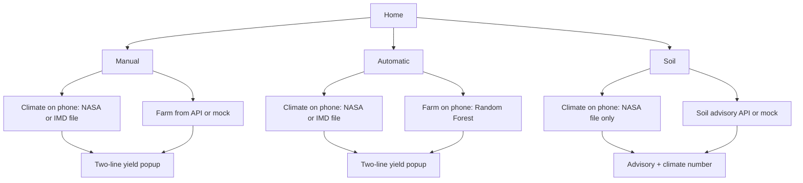

# NASF App — Complete Yield Calculation Guide

**Simple English.** This is the full story of how the app gets a yield number: what the farmer does, what the phone does, and how the maths is done.

**Screens covered**

1. Manually (`ManualDetails`)
2. Automatically (`AutomaticDetails`)
3. Management System (`SoilManagement`)

**How to read this file:** pictures (diagrams) first, then the same flow in words, then the calculation.

---

## Contents

1. [The two yield numbers](#1-the-two-yield-numbers)
2. [Complete app flow picture](#2-complete-app-flow-picture)
3. [Home dashboard](#3-home-dashboard)
4. [Weather source: NASA POWER vs IMD](#4-weather-source-nasa-power-vs-imd)
5. [Manual — flow and calculation](#5-manual--flow-and-calculation)
6. [Automatic — flow and calculation](#6-automatic--flow-and-calculation)
7. [Soil / Management — flow and calculation](#7-soil--management--flow-and-calculation)
8. [Climate Yield maths in detail](#8-climate-yield-maths-in-detail)
9. [Farm Yield maths in detail](#9-farm-yield-maths-in-detail)
10. [Worked example Amethi](#10-worked-example-amethi)
11. [What you see on the popup](#11-what-you-see-on-the-popup)
12. [Comparison table](#12-comparison-table)
13. [Files and models inside the app](#13-files-and-models-inside-the-app)
14. [FAQ / things people mix up](#14-faq--things-people-mix-up)

---

## 1. The two yield numbers

The app almost never gives **one** yield. It gives **two different answers** from **two different stories**.

| Name | Plain meaning | Typical display |
|------|----------------|-----------------|
| **Farm Yield** | “If I look at **this field** (soil, fertiliser, crop, and sometimes this year’s weather)…” | `1700 +- 479` (looks like kg/ha) |
| **Climate Yield** | “If I look only at **this area’s weather** (a bundled climate file)…” | `5.42` (tonnes per hectare) |



**Doctor analogy**

- Farm Yield = your personal lab report  
- Climate Yield = the area’s usual climate, not your fertiliser bag  

They must not be expected to match.

**Soil / Management** is the odd one out: it shows **soil properties + crop advice** first, then Climate Yield at the bottom. It does **not** run Farm Yield.

---

## 2. Complete app flow picture

This is the whole journey from opening the app to seeing a number.



**In words**

1. Farmer logs in and lands on Home.  
2. Farmer picks one of three yield-related screens (or 30-year charts).  
3. Farmer fills that screen’s form.  
4. Manual and Automatic also pick **NASA POWER** or **IMD**.  
5. Farmer taps **Calculate** or **Get Details**.  
6. The phone computes Climate Yield locally. Farm Yield / advisory depends on the screen (see later).  
7. One popup shows the result.

---

## 3. Home dashboard

| Button on Home | Where you go | What that screen is for |
|----------------|--------------|-------------------------|
| Manually / स्वयं | Manual Details | Full soil lab + fertiliser form. Farm Yield from a server. Climate Yield on the phone. |
| Automatically / स्वतः | Automatic Details | Shorter form. Farm Yield on the phone (weather + Random Forest). Climate Yield on the phone. |
| Management System | Soil Management | Location + crop only. Soil map advisory + Climate Yield. No weather toggle. |
| 30-Year Climate | Climate history charts | Not used for the two-line yield popup. |

---

## 4. Weather source: NASA POWER vs IMD

On **Manual** and **Automatic** only:

**मौसम स्रोत / Weather source** → **NASA POWER** | **IMD**

Soil Management has **no** toggle. It always uses the NASA weekly climate file.



| | NASA POWER | IMD |
|--|------------|-----|
| Climate Yield file | Weekly farm CSV already inside the app | Merged district CSV already inside the app |
| Season used for Climate Yield | June–October (weeks 23–44) | Full year (366 days) |
| Internet for Climate Yield | **No** | **No** |
| Internet for Automatic Farm Yield | **Yes** (live NASA daily) | **No** |
| Internet for Manual Farm Yield | Farm API or mock — **not** this toggle | Same |

**The surprise most people miss**

NASA **Climate Yield** does **not** call NASA on the internet. It opens a CSV that shipped with the app and finds the nearest farm.

Live NASA is used on Automatic **only** to build **Farm Yield** when NASA POWER is selected.

---

## 5. Manual — flow and calculation

### 5.1 Picture of the Manual flow



### 5.2 What the farmer fills

| Group | Fields |
|-------|--------|
| Location | State (UP, Bihar, Punjab, Haryana), Longitude, Latitude |
| Soil lab | pH, EC, Organic Carbon, Available N, P, K, Sulphur, Zn, Fe, Mn, Cu |
| Fertiliser / residue | Residue (Q/ha), Urea, DAP, MOP, Zinc sulphate, FYM, FYM interval |
| Crop | Rice or Wheat; Short / Medium / Long duration |
| Season | Sowing date, irrigation count, grain yield (Q/ha) |

### 5.3 Calculation — Farm Yield (Manual)

**Step A — bag to nutrient**

The farmer types product (Urea, DAP, MOP). The app converts to nutrients:

```text
N  = Urea × 0.46  +  DAP × 0.18
P  = DAP  × 0.46
K  = MOP  × 0.60
```

Example: 100 kg Urea + 50 kg DAP + 40 kg MOP

```text
N = 100×0.46 + 50×0.18 = 46 + 9 = 55 kg/ha
P = 50×0.46 = 23 kg/ha
K = 40×0.60 = 24 kg/ha
```

**Step B — harvest day**

```text
Short duration  → harvest = sowing + 100 days
Medium duration → harvest = sowing + 125 days
Long duration   → harvest = sowing + 150 days
```

**Step C — send to farm model**

The app posts location, soil lab values, converted N/P/K, sowing day, harvest day, irrigation, residue, FYM, grain yield.

- If the farm server answers: use that string.  
- If not, and mock is on: a **stand-in** yield that still changes when inputs change.

**Step D — display**

Farm Yield looks like `yield +- error` in kg/ha style.

**Climate Yield on Manual** never uses this server. It always runs on the phone (Section 8).

---

## 6. Automatic — flow and calculation

### 6.1 Picture of the Automatic flow



### 6.2 What the farmer fills

Same idea as Manual, **without** the soil lab block:

Location, residue (t/ha), Urea, DAP, MOP, zinc, FYM, crop, variety, sowing date, irrigation, grain yield (t/ha).

**Open NASA Weather** is a **separate** charts path. The two-line yield popup comes only from **Calculate**.

### 6.3 Calculation — Farm Yield (Automatic, NASA POWER)

This Farm Yield is **on the phone**, not the Manual server.

1. Download daily NASA POWER for the sowing year.  
2. Split days into **52 weeks**.  
3. Keep **weeks 23–44** (about June–October):

```text
season_rainfall_mm    = sum of weekly rainfall
season_t_max_mean     = average of weekly Tmax
season_humidity_mean  = average of weekly humidity
season_solar_mean     = average of weekly solar
season_wind_mean      = average of weekly wind
```

4. Add soil-like numbers. Automatic has no pH / OC / available-N fields, so the forest uses **typical defaults** unless the payload has a matching name:

```text
pH  default 7.2
OC  default 0.45 %
N   default 250 kg/ha
P   from DAP × 0.46 if present, else 18
K   from MOP × 0.60 if present, else 180
EC  default 0.4 dS/m
```

5. Random Forest outputs **tonnes/ha**.  
6. Screen shows:

```text
Farm Yield kg/ha   = round(t/ha × 1000)
plus-minus         = round(0.479 × 1000)   ≈ 479 kg/ha
display            = "1700 +- 479"
```

`0.479 t/ha` is the model’s typical error (MAE) from training.

### 6.4 Calculation — Farm Yield (Automatic, IMD)

1. Find nearest of **40 districts**.  
2. From 366 days:

```text
rain   = sum of daily IMD_pr_Mean
Tmin   = average of daily Tmin_Mean
Tmax   = average of daily Tmax_mean
```

3. Random Forest still wants wind, solar, humidity. IMD file does not have them, so the app fills **typical NASA medians**:

```text
wind      = 2.95 m/s
solar     = 18.05 kWh/m²/day
humidity  = 68.14 %
```

These are **not** IMD measurements. Solar is a large part of the forest, so IMD Farm Yield is “IMD rain/temperature + typical sunshine”.

### 6.5 Climate Yield (Automatic)

Same two paths as Manual — Section 8.

---

## 7. Soil / Management — flow and calculation

### 7.1 Picture



### 7.2 What the farmer fills

Only Longitude, Latitude, Crop, Variety, Grain yield (t/ha).

No weather toggle. No soil/fertiliser form. No Random Forest Farm Yield.

### 7.3 Calculation

**Climate Yield** = NASA weekly CSV path (Section 8.1). Always. Never IMD.

**The other half** is not Farm Yield. The app sends:

```text
{ Long, Lat, Grain_Yield_t_ha }
```

to a soil-advisory service (or a mock advisory). The popup lists map-based soil properties and crop management advice, then prints Climate Yield as `5.42`.

---

## 8. Climate Yield maths in detail

Climate Yield **never** uses the farmer’s Urea/DAP bag. It uses **location only**.

### 8.1 Picture: how “nearest” is chosen


Distance is “as the crow flies” (great-circle / haversine) in kilometres. Same idea as picking the nearest petrol pump.

### 8.2 NASA POWER climate path (weekly CSV)

**File:** `app/src/main/assets/data/rice_nasapower_weekly_segregated.csv`  
About **1,056** farms, each with weekly weather.

**Used by:** Manual + Automatic when NASA POWER is on; Soil always.

**Season:** weeks **23 to 44** (June–October rice window).

```text
rainfall   = week23_rain + week24_rain + … + week44_rain
Tmin       = average of week23…44 Tmin
Tmax       = average of week23…44 Tmax
wind       = average of week23…44 wind
solar      = average of week23…44 solar
humidity   = average of week23…44 humidity
```

Those **6 numbers** go into a small neural net:

```text
6 weather numbers  →  hidden layers  →  1 number = Climate Yield t/ha
```

Model file: `ml/yield_models_manual_climate_ann.json`.

You never type rain or temperature. The CSV already has them.

### 8.3 IMD climate path (merged district CSV)

**File:** `app/src/main/assets/data/Extract_Four_States_Tmax_Tmin_pr_1995-2025_merged.csv`  
**40 districts**, **366 days** each (including 29 February).

**Used by:** Manual + Automatic when IMD is on. **Not** Soil.

```text
annual_rainfall_mm = sum of 366 daily IMD_pr_Mean
annual_tmin_mean   = average of 366 Tmin_Mean
annual_tmax_mean   = average of 366 Tmax_mean
annual_pr_std      = average of 366 IMD_pr_std
annual_tmin_std    = average of 366 Tmin_Std
annual_tmax_std    = average of 366 Tmax_Std
```

Those **6 numbers** go into a **different** neural net:

```text
6 IMD year-stats  →  hidden layers  →  1 number = Climate Yield t/ha
```

Model file: `ml/yield_models_imd_merged_ann.json`.

**Why the two Climate Yields differ on the same field**

| | NASA climate | IMD climate |
|--|--------------|-------------|
| Map | Nearest of ~1,056 farms | Nearest of 40 districts |
| Season | June–October weeks | Full calendar year |
| Weather | Rain, Tmin, Tmax, wind, solar, humidity | Rain, Tmin, Tmax, and their 30-year stds |
| Model | NASA 6-input ANN | IMD 6-input ANN |

---

## 9. Farm Yield maths in detail



### Random Forest (Automatic) — what it looks at

Trained on June–October weather **and** soil, 1,056 farms, 25 trees.

| Input | Role in simple words |
|-------|----------------------|
| Season rainfall | How wet the season was |
| Season Tmax | How hot the days were |
| Season humidity | How moist the air was |
| Season solar | How much sun — **largest piece of the forest** |
| Season wind | How windy |
| pH, OC, N, P, K, EC | Soil fertility picture |

**Display formula (Automatic)**

```text
yield_kg = round(forest_t_ha × 1000)
error_kg = round(0.479 × 1000) = 479
show     = yield_kg +- error_kg
```

---

## 10. Worked example: Amethi

Farmer at **26.5° N, 81.5° E** (Amethi study point).



**IMD climate slice for this point (idea)**

- 366 rows for Dist_Code **D680**, tehsil AMETHI  
- Annual rain ≈ sum of daily `IMD_pr_Mean`  
- Tmin / Tmax ≈ yearly averages of daily means  
- Those six stats → IMD ANN → Climate Yield around **4.7 t/ha** in the trained model  

Same field, NASA vs IMD → **two different Climate Yields**. That is correct behaviour, not a bug.

---

## 11. What you see on the popup

**Manual / Automatic** — title **Yield Prediction**

```text
1700 +- 479
5.42
```

- Line 1 = Farm Yield (kg/ha style, with ±)  
- Line 2 = Climate Yield (t/ha, two decimals)  

There is **no** “Source: NASA / IMD” line in the popup. The source is the **bold** NASA POWER / IMD toggle on the form.

**Soil / Management**

```text
Soil Properties
  1. Organic Carbon / ... : …
  2. pH / ... : …
  …

Crop Management Advisory
  1. FYM / ... : …
  2. Urea / ... : …
  …

5.42
```

The last number is Climate Yield (t/ha).

---

## 12. Comparison table

| | Manual | Automatic | Soil / Management |
|--|--------|-----------|-------------------|
| Weather toggle | Yes | Yes | No — always NASA CSV |
| Farm Yield | Farm API or mock | Random Forest on phone | Not calculated |
| Climate Yield | NASA CSV or IMD CSV | NASA CSV or IMD CSV | NASA CSV only |
| Climate needs internet? | No | No | No |
| Other result needs internet? | Farm API unless mock | NASA toggle: live weather; IMD: no | Advisory API unless mock |
| Fertiliser conversion | Yes (Urea/DAP/MOP) | Yes (same N/P/K formulas) | No |
| Harvest from variety | Yes (100 / 125 / 150 days) | Yes (same) | No |
| Popup | Two yield lines | Two yield lines | Advisory HTML + climate |

---

## 13. Files and models inside the app

All under `app/src/main/assets/`.

| File | Role |
|------|------|
| `data/rice_nasapower_weekly_segregated.csv` | NASA Climate Yield — nearest farm, weeks 23–44 |
| `data/Extract_Four_States_Tmax_Tmin_pr_1995-2025_merged.csv` | IMD Climate Yield — 40 districts, 366 days |
| `ml/yield_models.json` | Automatic Farm Yield Random Forest |
| `ml/yield_models_manual_climate_ann.json` | NASA 6-input Climate ANN |
| `ml/yield_models_imd_merged_ann.json` | IMD 6-input Climate ANN |

**Code map (if you open Android Studio)**

| Piece | Job |
|-------|-----|
| `CsvClimateYieldBackend` | NASA climate: nearest farm + 6 averages |
| `ManualClimateAnnPredictor` | NASA climate ANN |
| `ImdClimatologyRepository` | IMD: nearest district + full-year totals |
| `ImdMergedClimateAnnPredictor` | IMD climate ANN |
| `OnDeviceYieldHelper` / `YieldModelPredictor` | Automatic Farm Yield |
| `CropDurationHelper` | Harvest = sowing + 100/125/150 |
| `CalendarWeeklyAnalyzer` | NASA daily → 52 weeks |

---

## 14. FAQ / things people mix up

**Why are the two popup numbers different?**  
Because they answer different questions: this field vs this area’s weather.

**Does NASA Climate Yield use the internet?**  
No. It uses a CSV inside the app.

**When does NASA need internet?**  
Automatic **Farm Yield** with NASA POWER selected (live daily weather).

**Does IMD Climate Yield use wind and solar?**  
No. It uses rain, Tmin, Tmax, and their variation (std). Wind/solar are filled only for Automatic **Farm** Yield on IMD.

**Does Soil Management have IMD?**  
No.

**Why kg/ha on one line and t/ha on the other?**  
Farm Yield is shown the old kg/ha way (`1700 +- 479`). Climate Yield is tonnes per hectare (`5.42`). 5.42 t/ha is 5420 kg/ha.

**If I change Urea, does Climate Yield change?**  
No. Climate Yield only cares about lat/lon (and the weather file).

**If I change lat/lon a little, Climate Yield jumps?**  
It can, if you crossed over to a different nearest farm or district.

---

## 15. One-sentence summary

The farmer enters a place (and, on Manual/Automatic, field details). The phone looks up bundled weather for **Climate Yield**. **Farm Yield** comes from a farm server (Manual), a Random Forest on the phone (Automatic), or is skipped in favour of soil advice (Soil).



---

*NASF Android app — complete yield-calculation documentation for Manual, Automatic, and Soil Management. Simple English for product, science, and testing teams.*
